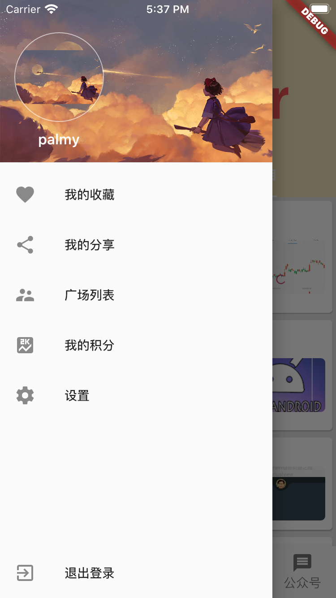
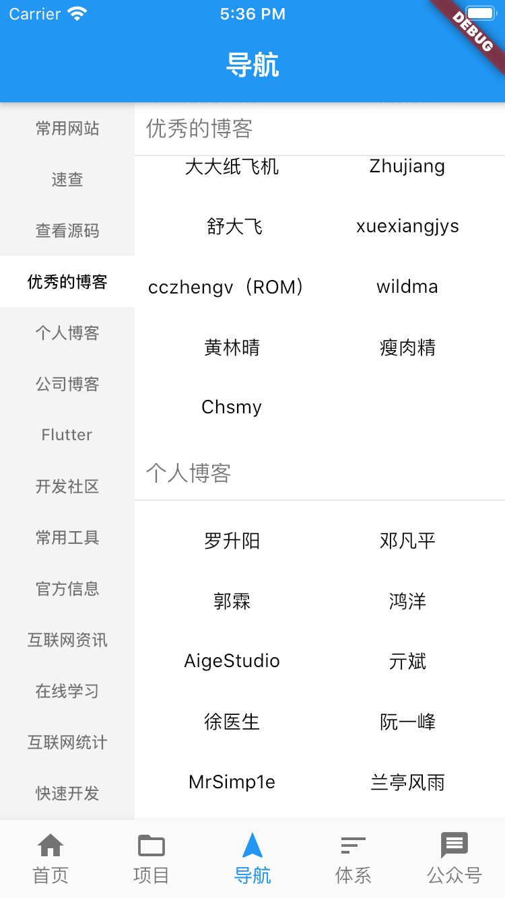
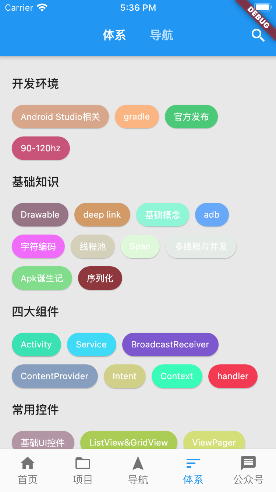
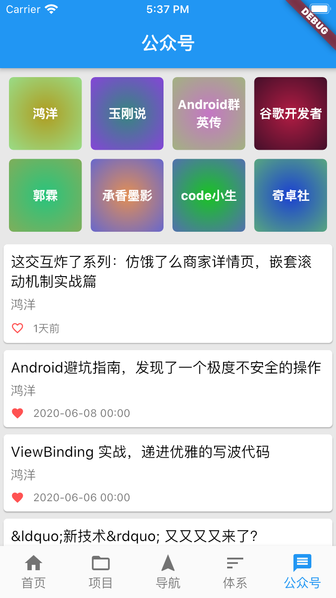
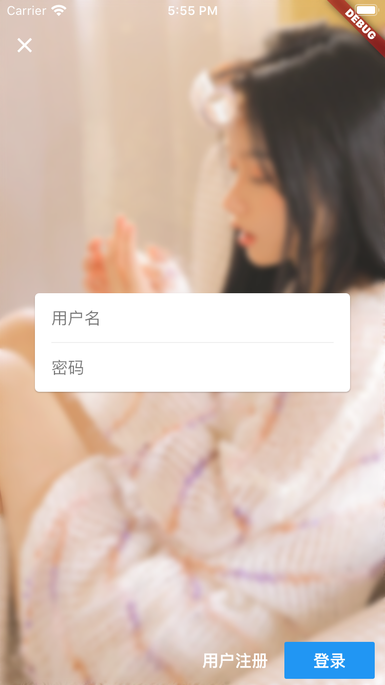
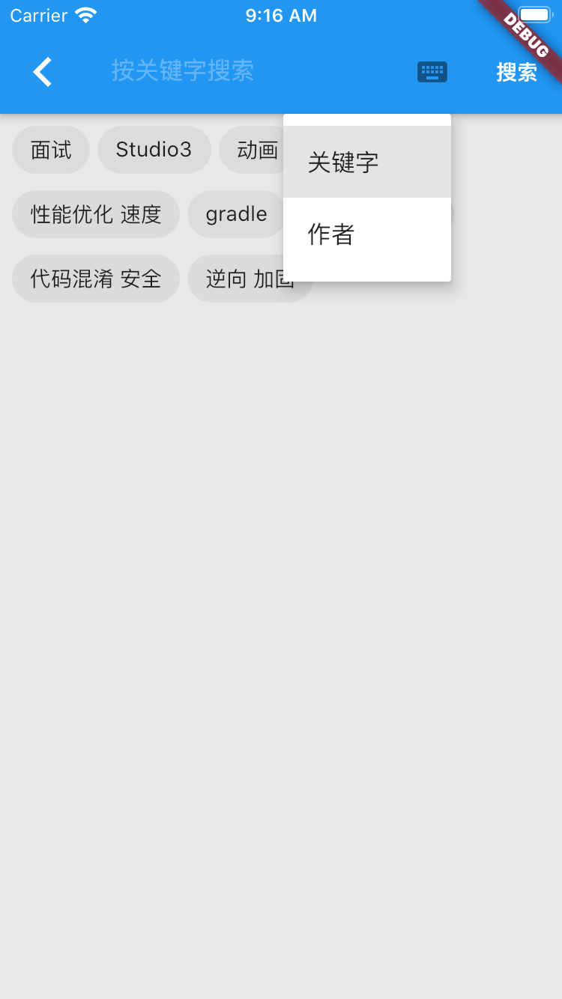

# 玩安卓Flutter客户端
# In development

## 项目截图

|  |  |  |
| ------ | ------ | ------ |
|  |  |  |
|  |  |  |

#### request
```
  Http().getTreeList().then((value) {
    _list.clear();
    _list.addAll(value);
  }).whenComplete(() => setState(() {}));
```
```
  // 返回普通List数据
  Future<List<TreeModel>> getTreeList() async {
    Response response = await _dio.get(API.TREE);
    return await checkResult(
        response, (element) => TreeModel.fromJson(element));
  }
```
```
  //返回分页List数据
  Future<BaseListModel<ArticleModel>> getArticleProjectList(int page) async {
    Response response = await _dio.get(
        '${API.ARTICLE_PROJECT_LIST}/$page/json');
    return await checkResult(
        response, (element) => ArticleModel.fromJson(element));
  }
```